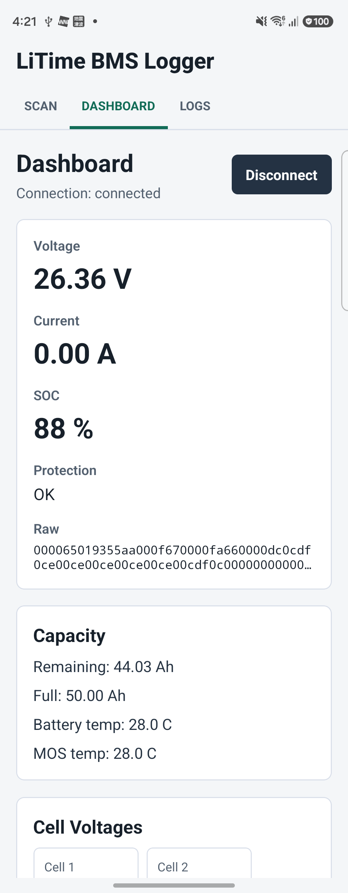
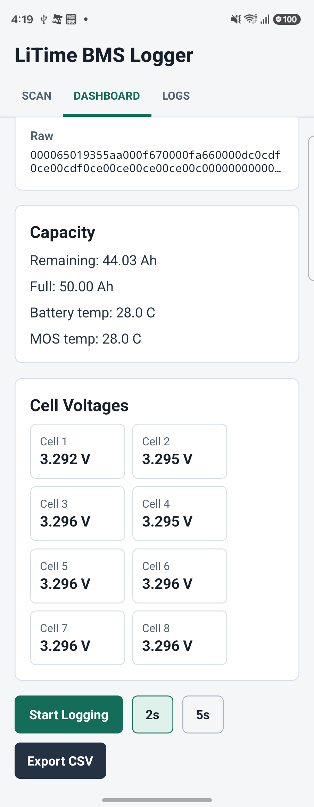
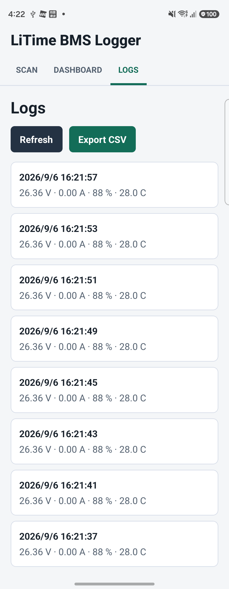

# LiTime BMS Logger

[](LICENSE)


*[日本語版 README](README.ja.md)*

LiTime BMS Logger is an Android-first React Native app for reading LiTime Bluetooth BMS battery telemetry over BLE, showing live values, saving logs locally, and exporting CSV files.

It reads only. Nothing in this app writes to the BMS, so it cannot change protection
thresholds, charging behaviour, or any other pack setting.

This app is not an official LiTime app.

## Screenshots

| Dashboard | Cell voltages | Logs |
| --- | --- | --- |
|  |  |  |

## Supported Devices

LiTime Bluetooth BMS batteries. Devices are recognised when they advertise a name that:

- starts with `LT-`, or
- starts with `L-` followed by a digit (for example `L-24050BNNA70-XXXXXX`), or
- contains `LiTime`

Verified against an `L-24050BNNA70` (24 V, 8S, 50 Ah) pack.

## Requirements

- Node.js 18+
- React Native Android development environment
- Android Studio / Android SDK
- Android device with BLE support

## Android Permissions

Android 12 / API 31 and later require runtime Bluetooth permissions for scanning and connecting:

- `BLUETOOTH_SCAN`
- `BLUETOOTH_CONNECT`

Android 11 / API 30 and earlier use legacy permissions:

- `BLUETOOTH`
- `BLUETOOTH_ADMIN`
- `ACCESS_FINE_LOCATION`

The manifest follows Android's current Bluetooth permission model: Android 12 introduced `BLUETOOTH_SCAN`, `BLUETOOTH_ADVERTISE`, and `BLUETOOTH_CONNECT`, and legacy Bluetooth permissions should be limited to Android 11 and earlier with `android:maxSdkVersion="30"`. See the official Android documentation: https://developer.android.com/develop/connectivity/bluetooth/bt-permissions

## BLE UUIDs

- Service: `0000ffe0-0000-1000-8000-00805f9b34fb`
- Notify: `0000ffe1-0000-1000-8000-00805f9b34fb`
- Write: `0000ffe2-0000-1000-8000-00805f9b34fb`

Commands have the form `00 00 04 01 <CMD> 55 AA <CMD + 0x04>`. The app sends the
status query once per second while connected:

```text
00 00 04 01 13 55 AA 17
```

## Protocol

The BMS answers with a 105-byte `0x93` frame on the notify characteristic.
**All multi-byte values are little endian.**

| Offset | Type | Field |
| --- | --- | --- |
| 0-1 | — | Header `00 00` |
| 2 | u8 | Payload length (`0x65` = 101); frame length = payload + 4 |
| 4 | u8 | Response code `0x93` (query `0x13` with the high bit set) |
| 8-11 | u32 | Undocumented — not a voltage, see Known gaps |
| 12-15 | u32 | Total voltage, mV (equals the sum of the cells) |
| 16-47 | u16 × 16 | Cell voltages, mV (unused slots read as 0) |
| 48-51 | i32 | Current, mA (negative = discharging) |
| 52-53 | i16 | Cell temperature, °C |
| 54-55 | i16 | MOSFET temperature, °C |
| 62-63 | u16 | Remaining capacity, 0.01 Ah |
| 64-65 | u16 | Full charge capacity, 0.01 Ah |
| 68-71 | u32 | Heat state (bit `0x80` = discharge disabled) |
| 76-79 | u32 | Protection flags |
| 80-83 | u32 | Failure flags (not surfaced — see Known gaps) |
| 84-87 | u32 | Balancing state (one byte per cell) |
| 88-89 | u16 | Battery state (`0` discharging, `1` charging, `4` charge disabled) |
| 90-91 | u16 | SOC, % |
| 92-93 | u16 | SOH, % |
| 96-99 | u32 | Discharge cycle count |
| 100-103 | u32 | Total discharge, mAh |
| 104 | u8 | Checksum: sum of bytes 0-103, mod 256 |

### Protection flags (offset 76)

| Bit | Meaning |
| --- | --- |
| `0x00000004` | Cell overcharge |
| `0x00000020` | Cell over-discharge |
| `0x00000040` | Charge overcurrent |
| `0x00000080` | Discharge overcurrent |
| `0x00000100` | High temperature 1 |
| `0x00000200` | High temperature 2 |
| `0x00000400` | Low temperature 1 |
| `0x00000800` | Low temperature 2 |
| `0x00004000` | Short circuit |

Bits outside this set are reported as raw hex rather than dropped. A pack reporting
nothing wrong leaves `protectionStatus` unset. The failure word at offset 80 is not
surfaced — see Known gaps.

### Frame validation

A frame is accepted only when the header, the length field, the response code, and the
checksum all agree. After decoding, the sum of the cell voltages is compared against the
total voltage; a mismatch beyond 0.05 V rejects the frame. Frames that fail any of these
checks are stored as raw hex only, so a protocol change degrades to logging rather than
to wrong readings.

### Known gaps

- **Current (offset 48)** read 0 in every capture so far, including one taken while the
  pack changed state. Confirming the offset needs a capture under a known charge or load.
- **Bytes 8-11** are undocumented and are **not** a voltage. They sat about 20 mV above
  the pack voltage across one session, then read 5124 in another while the pack itself
  held 26294 mV with SOC unchanged. This app ignores them and reports offset 12 as the
  total voltage, matching other LiTime tools.
- **Failure flags (offset 80)** are **not reported by this app.** The word read
  `0x00020001` on a healthy pack that was holding voltage, reporting no protection bits
  and no capacity change; it moved in step with the heat-state byte at offset 68 rather
  than with anything faulty. Its published description carries no bit meanings, so raising
  an alarm on it would only cry wolf. The raw frame is logged regardless, so the value
  stays available for later analysis.
- **Heat state (offset 68)** was observed going from `0x00` to `0xc0` as the pack
  temperatures rose, consistent with the documented `0x80` "discharge disabled" bit plus
  an undocumented `0x40`. Not decoded yet.

## Parsed Fields

Displayed and logged:

- Total voltage
- Current
- SOC
- Remaining capacity (Ah)
- Full capacity (Ah)
- Cell voltages
- Battery temperature
- MOS temperature
- Protection status
- Charge/discharge status
- SOH
- Cycle count
- Raw response as hex

## Development

Install dependencies:

```sh
npm install
```

Run Android:

```sh
npm run android
```

Type-check:

```sh
npm run typecheck
```

## CSV Export

Saved logs can be exported to:

```text
litime_bms_log_YYYYMMDD_HHMMSS.csv
```

On Android the file is written to the public downloads directory when available.

## Notes

- BLE errors are surfaced in the UI instead of crashing the app.
- Logging cannot start until a device is connected and telemetry has been received.
- Raw BLE notify data is saved as a hex string for future protocol verification.
- The first connection attempt often fails with Android GATT `status=133`; the client
  retries automatically after 2 seconds and normally succeeds within a few attempts.
- iOS is not implemented, but BLE, parser, database, and UI responsibilities are
  separated under `src/` to keep the structure portable.

## Acknowledgements

The BLE frame layout and the protection flag definitions come from community reverse
engineering, in particular:

- [rubenmuehlhans/litime-ble-hacs](https://github.com/rubenmuehlhans/litime-ble-hacs) (MIT) — protocol notes and flag definitions
- [calledit/LiTime_BMS_bluetooth](https://github.com/calledit/LiTime_BMS_bluetooth) (MIT) — earlier protocol work

The response checksum documented above is not part of those notes; it was derived from
captures taken with this app.

## License

Released under the [MIT License](LICENSE).

## Disclaimer

This app is not an official LiTime app. The BLE protocol is based on unofficial reverse engineering. The app is intended only for reading battery information and saving logs. It is not intended to modify battery control, protection, charging, or discharging behavior.

The software is provided as is, without warranty of any kind. The authors accept no liability for damage to a battery, or for any loss or injury, arising from its use.
